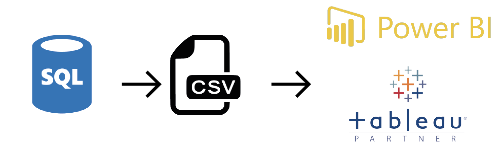
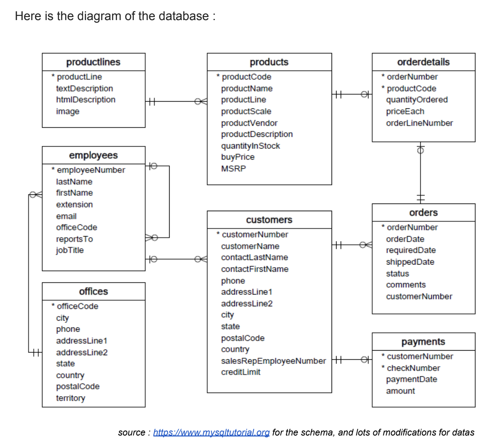

# Model company - Dashboarding

We are commissioned by a company selling models and scale models.

After giving us the keys to the database, the director would like us to answer some business questions : 

- Sales: The number of products sold by category and by month, with
comparison and rate of change compared to the same month of the previous
year.
- Finances: 
  1. The turnover of the orders of the last two months by country.
  2. Orders that have not yet been paid.
- Logistics: The stock of the 5 most ordered products.
- Human Resources: Each month, the 2 sellers with the highest turnover.

On a four-member-team, we had to answer the requirement and offer KPIS. Here is our action plan :

*Nota bene: sometimes business indicators are not technically achievable. It was up to us to explain it, and to bring our own ideas to answer the business needs.*

# Documentation

